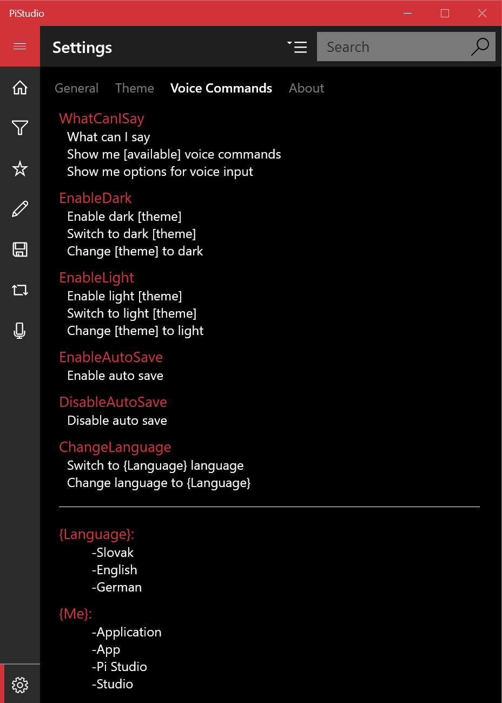

# PiStudio

Free, open source tool for editing photos that can be controlled by voice commands.

*PiStudio was created as demostration for usage of SpeechIntegrator library available for UWP platform yet. You can see that library is linked to UWP project. Interaction with library is performed with classes located in [Voice](https://github.com/limo1996/PiStudio/tree/master/PiStudio.Win10/Voice) folder.*

## Voice control
As mentioned above, PiStudio can be controlled by voice. Recognition starts when microphone icon on the left menu is clicked. 

 After click, voice UI animation starts. 

 It looks like two red concentric circles that are growing bigger and smaller. Application says that it is listening and now you are free to speak voice commands.

### Available voice commands
You can view all available voice commands by speaking "What can I say ?". If you do not want to speak, then just navigate to settings page and then choose Voice Commands subpage on the top of the screen. Voice commands are grouped by action they perform.

### PiStudio functionality
App provide just basic functionality. Nothing professional since this application is just example of intended usage of the speech recognition library. However, we paid a lot of attention to responsive and beautiful design. There are currently available these themes: 
* Dark
* light

PiStudio is available in these languages: 
* Slovak
* English
* German. 

These and more other settings can be changed via voice commands or on the settings page, which contains multiple sections. One of these sections shows all the available voice commands grouped by action they perform. Next contains general settings, another theme settings and last one is page about application where is name of the author, version, LinkedIn reference, link to the project at GitHub and button to run tests. 
PiStudio provides following functionality:
* Image rotation
* Image filters such as Gaussian, multiple Blur and Sharpen ones, Sobel and Sobel-Feldman
* Changes of image brightness 
* Drawing curves on an image including color and brightness pickers
* Image sharing via social networks
* Voice control

# SpeechIntegrator

Open source library for integrating your application with speech navigation and Cortana.

## Wiki
Please, do read our wiki!! It contains library documentation, FAQ, examples and much more...
*You can find complete reference to the speech library in our [Wiki](https://github.com/limo1996/PiStudio/wiki)*
